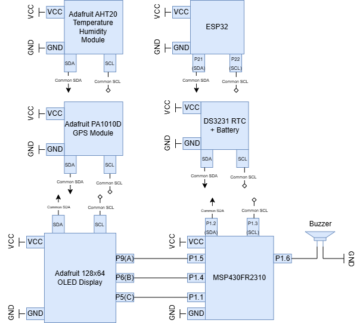

# Final project proposal

- [x] I have reviewed the project guidelines.
- [x] I will be working alone on this project.
- [x] No significant portion of this project will be (or has been) used in other course work.

## Embedded System Description

At a high level, explain in 2-3 sentences what your embedded system will do.  Then, in 1-2 sentences each, explain each input, the process, and each output. This section is the bulk of the proposal.

My embedded system will be a digital watch with advanced functionality. This advanced functionality will be composed of keeping track of the user's GPS coordinates, their altitude, the current temperature, and alarm functionality. Furthermore, the watch will be able to connect to a weather API, likely the National Oceanic And Atmospheric Administration's, to pull releveant weather data for the day consisting of temperature forecasts, humidity, and wind. 

For my microcontroller I will be employing the MSP4302310. As opposed to the dev board MSP430, this provides a far more compact option which is more suitable for a watch, albeit much of the other modules I will use will definitely make it a clunky fit. I'm aware that the MSP4302310 has strict memory limitations, so this is susceptible to change and I will either A) Use the dev board MSP or B) employ both MSP4302310s in some dual configuration, each controlling a certain suite of modules and communicating with each other.

For my display, I will be using an AdaFruit OLED 128x64 display which has three buttons. These buttons will correspond to a particular mode/instruction on that mode, such as displaying the current time, changing the current time, checking the forecast, etc. In turn, the microcontroller will send back the information to be displayed to the OLED display, thus showing the relevant data to the user. All of this will be done over I2C.

For GPS coordinates and altitude, I'll likely employ an Adafruit PA1010D which is capable of automatically polling GPS sattelites when requested and returning both coordinate and altitude data. This will communicate with the main microcontroller, who will then process and display the data to the display. This will be done over I2C.

Similarly, with an Adafruit AHT20 temperature/humidity module, I'll be able to poll local (that is, wherever the device is) temperature, which will be returned to the microcontroller for processing and display. Too, the module I will have a humidity sensor as well, so it can return local humidity to the microcontroller for procesing and display. This will be over I2C.

Using the DS3231 RTC module provided to us I'll be able to keep track of the current time and date. The user will be able to set the current time, using the inputs on the OLED display, which are first sent to the microcontroller before being sent to the RTC. Too, the RTC will send time data back to the microcontroller, which will be displayed on the OLED. This will be over I2C. This module also has a battery slot, so I will use a 3v coincell battery to power both it and the entire system.

Using a simple buzzer, I'll have an alarm capability added to the watch. The microcontroller will keep track of time from the RTC, and, using user input from the OLED display, the microcontroller will be able to set a specific time that the alarm will go off at to alert the user via the buzzer. This will be done via PWM on the pin which will power the buzzer so as not to be excessively loud.

Finally, I will utilize an ESP32 module to poll a weather API. Upon user request, the MSP430 will poll the ESP32, which in turn, will connect to a weather API, receive a forecast for both the day and the week with information such as wind, humidity, and temperature, and return this data to the main microcontroller for processing and display. This will likely be over I2C. The ESP32 will have trivial arduino code onboard only to access/interface with wifi and the internet and return this data over I2C when requested.

## Hardware Setup

What hardware will you require? Provide a conceptual circuit diagram and/or block diagram to help the reviewers understand your proposal. Be sure to introduce and discuss your figures in the text.

I will require the MSP430FR2310, The ESP32, The Adafruit OLED 128X64 Display, the Adafruit AHT20 Temperature/Humidity Module, the Adafruit PA1010D gps module, the DS3231 RTC, and finally the buzzer. It should be noted that the DS3231 RTC has a battery holder, so it will be what supplies the system via a 3 volt coin cell battery.

## Software overview

Discuss, at a high level, a concept of how your code will work. Include a *high-level* flowchart. This is a high-level concept that should concisely communicate the project's concept.

The MSP430 will be constantly polling each device to gather data from it in a round-robin fashion. One at a time, the MSP430 will poll the input device and gather the data from it. In the case of the climatic/locational/temporal data, this is relatively straight forward, as each value (temperature, coordinates, etc.), can be assigned their own buffer. In the case of the ESP32, the MSP430 will only poll it when requested by the user, as this operation takes longer and is also through an API which limits the amount of times a device can query it. This information will be processed into appropriate buffers. Onto outputs, the buzzer is relatively simple. Comparing the current time to the time selected by the user, the buzzer will be activated by the MSP over PWM. Furthmore, the display will function with the MSP constantly writing to it over I2C, sending over only the relevant information depending on which page the user has selected.

## Testing Procedure

I plan on demonstrating each feature of my watch. First, I'll demonstrate the main time/date display of the watch, which arguably is the most important. I'll demonstrate the ability of the watch to set the current time (like for daylight saving, new timezone, etc.), the date, and the alarm functionality. Next I'll move on to the climatic data the watch can read, displaying the temperature, and humidity, and if necessary moving between rooms or inside/outside to show it changing to local conditions. Finally, I'll demonstrate the forecast capability of the watch, switching between daily and weekly forecasts. This will require me to connect to the school's wifi ahead of time by manually programming the Arduino, as finding a way to implement this into the actual project would be rather difficult and take away from the main point of it, but shouldn't be a problem.

## Prescaler

Desired Prescaler level: 

- [ ] 100%
- [x] 95% 
- [ ] 90% 
- [ ] 85% 
- [ ] 80% 
- [ ] 75% 

### Prescalar requirements 

**Outline how you meet the requirements for your desired prescalar level**

**The inputs to the system will be:**
1.  Adafruit PA1010D GPS sensor; I'll be taking in both current GPS coordinates and altitude
2.  Adafruit AHT20 temperature/humidity module, inputting raw temperature and humidity data to be processed/converted to desired unit
3.  DS3231 RTC; Getting current time to the second and will also need to be manually set by the user through OLED I/O to desired time.
4.  ESP32; Providing data for both daily and weekly forecast that will need to be decoded by the MSP430. This requires some arduino code in order to receive/process
API data, but is pretty simple and not necessarily the "bare metal" programming this class emphasizes.
5.  Adafruit OLED display; Contains three buttons and a reset which will be utilized to navigate the basic GUI and modify settings of the watch such as alarm time,
setting the current time, or getting the forecast online, connected to GPIO pins which will connect to the MSP430.

**The outputs of the system will be:**
1.   Simple Buzzer; somewhat trivial, but will be powered via PWM by the microcontroller when the user's selected time is reached.
2.   Adafruit OLED display. This will be far more complicated, as I intend to essentially have multiple "pages" the OLED can cycle through to display relevant data
to the user.

**The project objective is**

Create a smart watch which is capable of providing a suite of relevant data to the user. Not only will they get their current time, but they'll be able to see the current temperature and humidity data at their current location, as well as be able to get the daily and weekly forecast. I can't promise it will be a necessarily ergonomic fit, but that is for other engineering disciplines.

**The new hardware or software modules are:**
1. AdaFruit OLED 128x64 display - OLED display with 3 input buttons and a reset, displays information provided to and formatted by I2C
2. Adafruit PA1010D - GPS module which can provide the user's location and altitude over I2C
3. Adafruit AHT20  temperature/humidity module - Provides temperature, and humidity over I2C
4. ESP32 - Microcontroller with onboard wifi and bluetooth capabilities. In this specific case, I will program it to act as a wifi receiver to get climate forecast data via an API, which it will provide to the MSP430.

The Master will be responsible for:
MSP430FR2310 - The backbone of the entire system, the MSP430 microcontroller will be responsible for creating the I2C queries for each slave and receiving all their data. The MSP430 will then transmit transmit this data to the OLED display depending on which page is opened, as well as operate the buzzer module for alerting the user.

The Slave(s) will be responsible for:
Providing all relevant time and climate data to the MSP430, as well as display relevant information in the case of the OLED display or the buzzer. Furthermore, the OLED display has three buttons which will directly interface with the MSP430 and allow for user input to cycle between pages or directly modify settings such as the alarm or setting the time.

### Argument for Desired Prescaler

I use several new modules for gathering climate and locational data, never of which have been used in this class (barring temperatre). Processing the local temperature, humidity, pressure, coordinates, and altitude of the user will require multiple new methods to both process and convert to their metric units to be displayed upon the OLED display. Furthermore, I will be gathering data from the internet via the ESP32 through an API, and while the code onboard the ESP32 doesn't really count, I'm creating a well-rounded embedded system which highlights my ability as an embedded systems engineer, showcasing my knowledge of networks/internet protocol I've garnered as a computer science major with my ability to efficiently program a microcontroller to handle and display various collected data.

While I only have two outputs, one being somewhat trivial as it's a simple PWM-controlled buzzer, the other is far more complex. The OLED display I will use will have several "pages" it will need to switch between and in a timely manner, each displaying different data and providing a neat GUI to the user. Too with the numerous different input modules I'm integrating, including accessing the internet through he ESP32, I believe this more than makes up for my limited data outputs.
